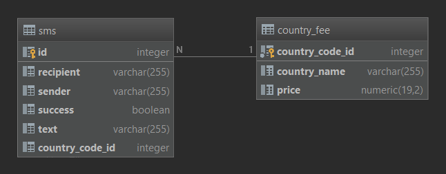

# mitto.sms-CLI


## Used technologies and frameworks
java 8, Spring-boot, maven, hibernate, sqlite


## Intro
Program is using file-based DB and remembers all previous stored records (SMSs and Country Fees).  

DB schema:



`LIMITATION 1`
In case of SMS records there is no reason for checking duplicates records, but in case of Country Fees
program does not allow input duplicate record for same country code. Update is also not implemented. 

`LIMITATION 2`
SMS table contains boolean column `success` meaning SMS record was saved with reference on country_fee. If
in time of persisting of SMS record doesn't exist country_fee, SMS will set `success` column to false and there is no 
process which will fix those sms ref 


Program runs 2 threads:

`thread 1`Thread always stars with parsing country fee records if they are provided in command line parameters. After 
that program handle file for sms records. Both files are optional and we are able starts without them. When program 
finish initial files loading we will get into user interface (witch is implemented as Console line) and we are able to 
operate program. 

Allowed commands for command line are: 
* **quit** - terminate program 
* **\<recipient\>\<space\>\<recipient\>\<space\><text message\>** - sms formatted record
* **stats** **\[-option\]** - stats command works only if program got file containing country fee records in command line option `-f`
    * **-s** - print top 5 ordered senders stats \<sender\>\<space\>\<sms count\>\<space\>\<total cost\>
    * **-c** - print all ordered country fee stats \<country name\>\<space\>\<sms count\>\<space\>\<total cost\>
    * empty - same as `-c` option

 


## How to use

Run this command from the source code:

```
mvn spring-boot:run -Dspring-boot.run.arguments="-m sms_file -f country_fee_file"
```

Run parameters:

* `-s sms_file` - [optional] sms_file file containing SMS records in format `<sender: alphanumeric, MSISDN><space><recipient: MSISDN format><text: alphanumeric (one word message doesn’t have to be in quotes), max 256 characters>` 

* `-f fee_file` - [optional] fee_file file containing COUNTRY_FEE records in format `<country code: max 3 digits><space><country name: varchar><space><price: unsigned integer, fixed 3 decimals, . (dot) as decimal separator>`

* `-h` - starts program and prints help

