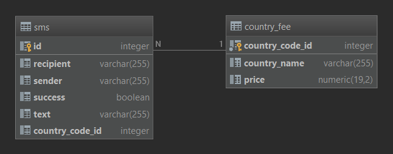

# mitto.sms-CLI

Command line program that keeps a record of processed SMS messages.
Program provides calculation of simple data views0 
* Top 10 senders stats
* Country fee stats (only in case user specify pricing information via `-f file` option)

## Requirements

For building and running the application you need:

- [JDK 1.8](http://www.oracle.com/technetwork/java/javase/downloads/jdk8-downloads-2133151.html)
- [Maven 3](https://maven.apache.org)

## Used technologies and frameworks

- [Spring-boot 2.4.4](https://spring.io/projects/spring-boot)
- [Hibernate 5.4.30.Final](https://hibernate.org/)
- [Sqlite 3.34.0](https://www.sqlite.org/index.html)
- [Project lombok 1.18.20](https://projectlombok.org/)
- [JUnit 5](https://junit.org/junit5/)

## How to run

For starting application run this command from the source code:

```
mvn spring-boot:run -Dspring-boot.run.arguments="-m sms_file -f country_fee_file"
```

Run parameters:

* `-Dspring-boot.run.arguments` passing the arguments into Spring Boot 2.x application

    * `-s sms_file` - [optional] sms_file file containing SMS records in format `<sender: alphanumeric, MSISDN><space><recipient: MSISDN format><text: alphanumeric (one word message doesn’t have to be in quotes), max 256 characters>` 

    * `-f fee_file` - [optional] fee_file file containing COUNTRY_FEE records in format `<country code: max 3 digits><space><country name: varchar><space><price: unsigned integer, fixed 3 decimals, . (dot) as decimal separator>`

    * `-h` - starts program and prints help 


For starting tests:

```
mvn test
```

## Testing

Implemented only few unit tests for basic validation inputs and processing data. 


## Documentation 

- [JavaDoc.zip](documents/java-doc.zip)

## Intro

Program is using file-based DB and remembers all previous stored records (SMSs and Country Fees).  

DB schema:



`LIMITATION 1`
In case of persisting SMS records there is no reason for checking duplicated records. In case of Country Fees,
program does not allow input duplicated records for same country code. Update is also not implemented. 

`LIMITATION 2`
SMS table contains boolean column `success`. Meaning SMS record was saved with reference on country_fee. If
in time of persisting of SMS record doesn't exist country_fee (can't find matching country code), SMS will set `success` 
column to false and there is no process which will fix those sms ref to country_fee


**Program runs 2 threads:**

`thread 1`Thread always stars with parsing country fee records if they are provided in command line parameters. After 
that program handle file for sms records. Both files are optional and we are able to start it without them. When program 
finish loading files we will get into user interface (witch is implemented as Console line) and we are able to 
operate program. 

Allowed commands are: 
* **quit** - terminate program 
* **\<recipient\>\<space\>\<recipient\>\<space\><text message\>** - sms formatted record for persist
* **stats** **\[-option\]** - stats command works only if program got file containing country fee records in command line option `-f`
    * **-s** print top 10 ordered senders stats \<sender\>\<space\>\<sms count\>\<space\>\<total cost\>
    * **-c** print all ordered country fee stats \<country name\>\<space\>\<sms count\>\<space\>\<total cost\>
    * empty - same as `-c` option
    
whenever invalid command is pressed in command line console will print error message in human form. e.g.
```
test
Incorrect number of arguments [test]. Valid format <alphanumeric or MSISDN><SPACE><MSISDN><SPACE><alphanumeric (one word message doesn’t have to be in quotes), max 256 characters>

Joh' 381901987654 Hurry
Input [Joh' 381901987654 Hurry]: Sender [Joh'] is in incorrect format <alphanumeric or MSISDN>
```

for valid message we will see this output
```
John 391901987654 Hello
SMS(sender=John, recipient=391901987654, text=Hello) saved

381902555666 391901987654 "Bring some beer"
SMS(sender=381902555666, recipient=391901987654, text="Bring some beer") saved
```

`thread 2`
Thread starts at beginning of program and it is printing **top 10 ordered senders stats** in 1 min intervals.
Format of **top 10 senders stats** differs by program argument:
* `<sender><space><sms count>` default 
* `<sender><space><sms count><space><total cost>` if user starts program with option `-f file`: 
  


